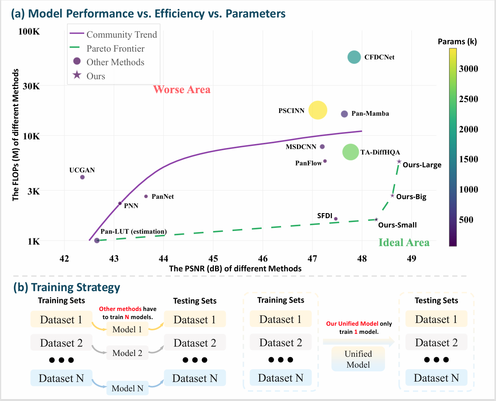

### Overview

Codebase for paper "Rethinking Pan-sharpening: Principled Design, Unified Training, and a Universal Loss Surpass Brute-Force Scaling".




### Introduction

This is a pan-sharpening research codebase designed for efficient experimentation and reproducible research. It provides a unified framework for training, evaluating, and comparing different pan-sharpening models across multiple satellite datasets using a unified training paradigm. **One model, three datasets**.

#### Key Features

- **Unified Experiment Framework**: Single configuration file to run multiple experiments with automatic result collection
- **Multi-Dataset Support**: Automatic evaluation on WV2, WV3, and GF2 datasets with both reduced and full-resolution testing
- **Comprehensive Metrics**: Automatic calculation of both reference and no-reference metrics
- **Model Zoo**: Extensive collection of implemented pan-sharpening models including PanNet, PNN, MSDCNN, PanFormer, PanMamba, CFDCNet, and our proposed methods
- **Flexible Configuration**: Hierarchical YAML configuration with inheritance and override support
- **Automatic Reporting**: Detailed experiment reports with performance comparisons and model statistics
- **Reproducible Research**: Automatic config saving, seed control, and deterministic training

#### Codebase Architecture

```
newpan_2411/
├── runner.py              # Main experiment runner
├── solver/
│   ├── unisolver.py      # Universal solver for all experiments
│   └── basesolver.py     # Base solver class
├── model/                # Model implementations
│   ├── panrestormer.py   # Our proposed PanRestormer
│   ├── pannet.py         # PanNet implementation
│   ├── panmamba.py       # PanMamba implementation
│   └── ...               # other models
├── data/
│   └── data.py           # Enhanced data loading with multi-dataset support
├── utils/
│   ├── metrics.py        # Comprehensive metrics calculation
│   ├── loss.py           # Various loss functions
│   └── ...               # Other utilities
└── configs/              # Experiment configurations
    ├── example/
    └── 4T/               # Our experiment configs
```

#### Available Models

The codebase includes implementations of major pan-sharpening methods:

- **Classical Methods**: PNN, PanNet, MSDCNN
- **Attention-Based**: PanFormer with various attention mechanisms
- **State-Space Models**: PanMamba (with Mamba blocks)
- **Research Variants**: M1-M6 (our experimental models with different fusion strategies)

Download link for [Weights](https://github.com/Zirconium233/PanTiny/tree/master/checkpoints/model)

#### Environment Setup

**Quick Start**

We recommend using `uv` for environment management.

If you already have `uv`, simply run:
```bash
uv sync
```

Otherwise, you can install `uv` with one of the following commands:
```bash
conda install uv           # install with conda
pip install uv             # install in your environment
curl -LsSf https://astral.sh/uv/0.7.18/install.sh | sh  # official method, installs at user level
```

If you prefer not to use `uv`, you can manually install the dependencies with conda or pip:
```bash
conda env create -n xxx
conda activate xxx
pip install -r requirements.txt  # Note: PyTorch 2.7+ is not available in conda channels
```

Our codebase does not require any specific version of Python, PyTorch, or CUDA. PyTorch 2.1, 2.6, 2.7 and CUDA 11.8, 12.8 have all been tested. In most cases, your local environment should work without additional setup.

**Additional Dependencies**

If you want to reproduce Pan-Mamba results, the following additional dependencies are required:
```bash
git clone https://github.com/hustvl/Vim.git
cd Vim/causal-conv1d
uv pip install -e . # if you use pip, just remove uv
cd ../mamba-1p1p1
uv pip install -e .
```
We have not compiled Vim's packages with PyTorch 2.7 and CUDA 12.8. If you encounter any issues, we suggest using PyTorch 2.1 and CUDA 11.8, which have been tested. Simply edit the `pyproject.toml` file to switch to the older version.

#### Configuration Usage

We recommend reproducing our results using our codebase. If you use other codebases like [Pan-Mamba](https://github.com/alexhe101/Pan-Mamba.git) or [MSDCNN](https://github.com/alexhe101/MSDDN.git), you may need to concatenate datasets manually and test multiple times for each experiment. In our codebase, we have implemented automatic dataset concatenation and multi-run testing. You can focus on model implementation and hyperparameter tuning by simply editing the config file to run a series of experiments.

#### Configuration Structure

Our codebase uses a hierarchical YAML configuration system that supports both single experiments and batch experiments. The configuration consists of two main parts:

1. **Base Configuration**: Common settings shared across all experiments
2. **Experiments List**: Individual experiment configurations that override base settings

Here's the basic structure (see `configs/example/example.yml` for a complete example):

```yaml
# Base configuration - shared by all experiments
base_config:
  algorithm: "panrestormer"  # Model to use
  nEpochs: 200              # Training epochs
  gpu_mode: true
  save_best: true

  # Multi-dataset support
  data_dirs:
    train:
      WV2: ../data/WV2_data/train128
      WV3: ../data/WV3_data/train128
      GF2: ../data/GF2_data/train128
    eval:
      WV2: ../data/WV2_data/test128
      WV3: ../data/WV3_data/test128
      GF2: ../data/GF2_data/test128

  # Training configuration
  data:
    batch_size: 16 # We use 16 as batch size to ensure most methods do not OOM on 8GB VRAM devices. Based on our experiments, with the same epochs, higher batch size yields better performance.
    patch_size: 32
    n_colors: 4

  data_usage:
    # datasets: ["WV2", "WV3", "GF2"]  # Use all three datasets for training
    datasets: ["WV2"] # Choose which datasets to train on
    usage_percent: 1.0 # You can change data usage percentage for ablation studies
    data_seed: 42
    balance_datasets: false

  # Evaluation configuration
  evaluation:
    full_resolution_in_val: false # If you enable this, training may be slow
    full_resolution_in_test: true
    save_all_test_images: true
    test_models: # Which checkpoints to save (and test)
      latest: true
      bestPSNR: true
      bestSSIM: false
      bestQNR: false
    # Evaluation settings
    eval_interval: 20 # Validate once every 20 training epochs
    save_interval: 20
    use_YCbCr: false

  schedule:
    lr: 4e-5
    optimizer: ADAM

# Individual experiments
experiments:
  - name: "baseline"
    description: "Baseline experiment"
    algorithm: "panrestormer"
    model:
      base_filter: 64
      downsample_levels: 0

  - name: "enhanced"
    description: "Enhanced model with attention"
    model:
      base_filter: 64
      downsample_levels: 2
      fusion_type: "attention"
```


#### Serial Experiments and Override Rules

Our system supports **serial experiments** where multiple experiments are run sequentially. Each experiment inherits the base configuration and can override specific parameters:

1. **Inheritance**: Each experiment starts with the complete `base_config`
2. **Override**: Any parameter specified in an experiment overrides the base value
3. **Deep Merge**: Nested dictionaries are merged recursively (e.g., `model.base_filter` overrides only that specific parameter)

**Override Priority** (highest to lowest):
- Experiment-specific parameters
- Base configuration parameters
- Default values in the code

#### Usage Examples

**Example 1: Model Architecture Comparison**
```yaml
base_config:
  algorithm: "panrestormer"
  nEpochs: 200
  data:
    batch_size: 16

experiments:
  - name: "small_model"
    description: "Small model with 32 filters"
    model:
      base_filter: 32
      downsample_levels: 0

  - name: "medium_model"
    description: "Medium model with 64 filters"
    model:
      base_filter: 64
      downsample_levels: 1

  - name: "large_model"
    description: "Large model with 128 filters"
    model:
      base_filter: 128
      downsample_levels: 2
```

**Example 2: Loss Function Ablation Study**
```yaml
base_config:
  algorithm: "panrestormer"
  model:
    base_filter: 64

experiments:
  - name: "l1_only"
    description: "L1 loss only"
    loss:
      L1:
        enabled: true
        weight: 1.0
      MEF_SSIM:
        enabled: false
      focal:
        enabled: false

  - name: "l1_ssim"
    description: "L1 + SSIM loss"
    loss:
      L1:
        enabled: true
        weight: 0.8
      MEF_SSIM:
        enabled: true
        weight: 0.5
      focal:
        enabled: false

  - name: "l1_ssim_focal"
    description: "L1 + SSIM + Focal loss"
    loss:
      L1:
        enabled: true
        weight: 0.8
      MEF_SSIM:
        enabled: true
        weight: 0.5
      focal:
        enabled: true
        weight: 0.4
```

#### Running Experiments

To run your experiments:
```bash
python runner.py --config configs/example/example.yml
```

Or use a specific config file:
```bash
python runner.py configs/experiment17.yml
```

#### Results and Metrics

After running experiments, comprehensive results and metrics are automatically calculated and saved. You don't need to run `test.py` specifically—results are automatically saved in the experiment directory. However, if something goes wrong, you can run `test.py` to test the models again; the results and metrics will be printed but not saved.

```bash
python test.py ../Out/experiment20_loss_deep_exploration_1751443087/
```

#### Metrics Calculated

Our codebase automatically calculates comprehensive metrics for pan-sharpening evaluation:

**Reference Metrics** (with ground truth, on reduced-resolution datasets):
- **PSNR**: Peak Signal-to-Noise Ratio (higher is better)
- **SSIM**: Structural Similarity Index (higher is better)
- **CC**: Correlation Coefficient (higher is better)
- **SAM**: Spectral Angle Mapper (lower is better)
- **ERGAS**: Erreur Relative Globale Adimensionnelle de Synthèse (lower is better)

**No-Reference Metrics** (without ground truth, on full-resolution datasets):
- **D_λ**: Spectral distortion index (lower is better)
- **D_s**: Spatial distortion index (lower is better)
- **QNR**: Quality with No Reference (higher is better, QNR = (1-D_λ)(1-D_s))

#### Result Table

For each experiment, you should get a table like the following:
```
================================================================================
COMPREHENSIVE METRICS RESULTS
================================================================================

REFERENCE METRICS (with ground truth):
------------------------------------------------------------
Dataset         PSNR      SSIM        CC       SAM     ERGAS
------------------------------------------------------------
WV2          36.7224    0.9320    0.9434    0.0408    1.5486
WV3          21.4286    0.5737    0.7376    0.1369    9.4398
GF2          34.7042    0.9265    0.8162    0.0368    1.8020

NO-REFERENCE METRICS (full resolution):
------------------------------------------------------------
Dataset     D_lambda       D_s       QNR
------------------------------------------------------------
WV2           0.0000    0.0000    0.0000
WV3           0.0000    0.0000    0.0000
GF2           0.0000    0.0000    0.0000
```
If some metrics are not applicable (e.g., no full-resolution ground truth available, not enabled, or the method reported an error), they will be displayed as zero.

You will also receive a comprehensive report like the following:
```
====================================================================================================================================================================================
Model                     Algorithm    Params(K)    FLOPs(M)     Size(MB)   Time(h)  WV2_PSNR   WV2_SSIM   WV2_SAM    WV3_PSNR   WV3_SSIM   WV3_SAM    GF2_PSNR   GF2_SSIM   GF2_SAM
------------------------------------------------------------------------------------------------------------------------------------------------------------------------------------
panflow_orig(16bs)        panflow      87.3         2861.37      0.33       3.29     41.5541    0.9677     0.0234     30.2634    0.9179     0.0775     47.7515    0.9869     0.0106
panflow_bs165eclp4augg    panflow      87.3         2861.37      0.33       4.73     40.7046    0.9629     0.0249     29.8801    0.9127     0.0811     46.5685    0.9834     0.0123
panflow_bs161eclp04       panflow      87.3         2861.37      0.33       4.58     41.1635    0.9654     0.0243     30.0869    0.9153     0.0798     47.0548    0.9850     0.0114
panflow_bs45eclp4         panflow      87.3         2861.37      0.33       9.76     41.4867    0.9673     0.0235     30.1712    0.9171     0.0785     47.2323    0.9854     0.0111
panrestormer_2ds          panrestormer nan          OOM          nan        nan        nan        nan        nan        nan        nan        nan        nan        nan        nan
====================================================================================================================================================================================
```

#### Results Directory Structure

The codebase organizes results in a hierarchical directory structure:

```
../Out/big_exp_name/
├── experiment_name_{timestamp}/           # Experiment name from config
│   └── timestamp/            # Unix timestamp when experiment started
│       ├── checkpoints/      # Model checkpoints
│       │   ├── bestPSNR.pth # Best model by PSNR
│       │   ├── bestSSIM.pth # Best model by SSIM
│       │   └── latest.pth   # Latest checkpoint
│       ├── logs/            # Training logs and tensorboard files
│       │   └── events.out.tfevents.*
│       └── results/         # Experiment results and reports
│           ├── config.yml   # Copy of experiment configuration
│           ├── test_results/ # Test images (if save_images enabled)
│           └── comprehensive_report.txt # Detailed results report
```
If you run a series of experiments, the results will be organized as follows:

```
../Out/
└── experiment_name_timestamp/           # Main experiment batch directory
    ├── comprehensive_report.txt         # Overall comparison report
    ├── bug_report.txt                  # Error logs for failed experiments
    ├── experiment1/                    # Individual experiment 1
    │   └── timestamp/                  # Experiment timestamp
    │       ├── checkpoints/            # Model checkpoints
    │       │   ├── bestPSNR.pth       # Best model by PSNR
    │       │   ├── bestSSIM.pth       # Best model by SSIM
    │       │   └── latest.pth         # Latest checkpoint
    │       ├── logs/                  # Training logs
    │       │   └── events.out.tfevents.*
    │       └── results/               # Individual results
    │           ├── config.yml         # Experiment config
    │           └── test_results/      # Test images
    ├── experiment2/                   # Individual experiment 2
    │   └── timestamp/
    │       ├── checkpoints/
    │       ├── logs/
    │       └── results/
    └── experiment3/                   # Individual experiment 3
        └── timestamp/
            ├── checkpoints/
            ├── logs/
            └── results/
```

The `comprehensive_report.txt` contains a detailed comparison table like this:

```
COMPREHENSIVE EXPERIMENT REPORT
================================================================================
Generated at: 2024-07-02 15:30:45
Total experiment time: 4.25 hours

EXPERIMENT SUMMARY:
Total experiments: 3
Successful: 3
Failed: 0

MAIN COMPARISON TABLE:
====================================================================================================================================================================================
Model                     Algorithm    Params(K)    FLOPs(M)     Size(MB)   Time(h)  WV2_PSNR   WV2_SSIM   WV2_SAM    WV3_PSNR   WV3_SSIM   WV3_SAM    GF2_PSNR   GF2_SSIM   GF2_SAM
------------------------------------------------------------------------------------------------------------------------------------------------------------------------------------
baseline                  panrestormer 168.6        501.36       0.64       1.20     32.4567    0.9234     3.2145     31.8934    0.9156     3.4567     33.1234    0.9345     2.9876
enhanced_attention        panrestormer 174.2        523.45       0.66       1.35     33.2145    0.9312     3.0234     32.5678    0.9234     3.2345     33.8765    0.9423     2.8234
large_model               panrestormer 674.5        2005.44      2.57       2.45     34.1234    0.9456     2.8765     33.6789    0.9378     3.1234     35.0123    0.9567     2.6789
====================================================================================================================================================================================

INDIVIDUAL EXPERIMENT DETAILS:
--------------------------------------------------

Experiment: baseline
Description: Baseline model with standard configuration
Algorithm: panrestormer
Success: True
Training time: 1.20 hours
Results directory: ../Out/loss_ablation_1672934567/baseline/1672934567
Parameters: 168624
FLOPs: 501360000
------------------------------

Experiment: enhanced_attention
Description: Enhanced model with attention fusion
Algorithm: panrestormer
Success: True
Training time: 1.35 hours
Results directory: ../Out/loss_ablation_1672934567/enhanced_attention/1672934568
Parameters: 174234
FLOPs: 523450000
------------------------------
```

#### Multi-Dataset Evaluation

Our codebase supports automatic evaluation on multiple datasets:

- **WV2**: WorldView-2 satellite data (8 spectral bands → 4 bands for pan-sharpening)
- **WV3**: WorldView-3 satellite data (8 spectral bands → 4 bands for pan-sharpening)
- **GF2**: GaoFen-2 satellite data (4 spectral bands)

Each experiment is evaluated on all configured datasets, and both individual and average metrics are reported.

#### Accessing Results

1. **Console Output**: Real-time metrics during training and final results summary
2. **TensorBoard**: Training curves and validation metrics (`tensorboard --logdir ../Out/experiment_name/timestamp/logs`)
3. **Comprehensive Report**: Detailed text report with all metrics and comparisons
4. **Config Copy**: Exact configuration used for reproducibility
5. **Model Checkpoints**: Best models saved for inference and further analysis

### Running Our Experiments

See `configs/` folder. 

### Troubleshooting

1. In the old codebase, `data['upscale']` had a spelling error—it was written as 'upsacle'. We have fixed this, and now you can use either spelling. However, if any bugs related to this occur, try using the alternative spelling.
2. The method `sdfi.py` is actually SFDI. If you want to fix this, simply rename the file and the class name within the file, and update the config file accordingly.
3. The VGG loss and GAN loss may not work properly—we haven't tested them thoroughly. Some users report that they actually lower performance. You can try them if you wish.
4. The naming in the `pantiny` model is misleading: the "refinement" module is actually the latent module, while `advanced_refine` is the true refinement module. We kept the name "refinement" to maintain compatibility with previous weights, which is why the name `advanced_refine` appears for the actual refinement module.
5. `Panrestormer` is our small model version, not a reproduction of the original Restormer. We kept this name to load previous configurations.
6. If you want to perform inference with (1024, 1024) size tensors on Pan-Mamba or CFDCNet, you need to modify the code. They use fixed sizes in their implementation, which we copied directly:
```python
# For Pan-Mamba
ms = global_f.transpose(1, 2).view(B, C, 128, 128) # -> change to 1024 x 1024
```
```python
# For CFDCNet
self.featdim = 1049600 # change to channel * H * W during __init__, should be 33554432
```

<!-- 8. SFDI -->

### Additional Explanations

1. **Why is training time not correlated with parameter count?** The training times provided in the table are not very accurate. Some methods, such as Pan-Mamba, do not actually require 20+ hours to train. Other users were using the same GPU simultaneously, which slowed down our training speed. These times should be considered as rough references only.

2. **Why not simply increase all loss weights?** You might notice in the loss table above that a loss weight combination of (3,3,3) performs better than (1,3,1). We didn't delve into this in detail in the paper, or rather, we avoided this issue. In fact, this is a direction worth exploring further:

---

  * For some models, a weight ratio of (0.8, 3, 1) is better than (1.5, 4, 1.5). For instance, CFDCNet can achieve a PSNR of 42.6 on the WV2 dataset with the former, but for PanTiny, the latter performs better.
  * The loss consistently decreased throughout the training process rather than fluctuating. We believe 500 epochs did not allow the model to converge optimally. Increasing the learning rate (or the weights of all losses) might achieve the effect of more epochs within the same 500-epoch limit.
  * When increasing all weights, the primary improvement came from the increased weight of SSIM, with the other two showing slight but not significant improvements.
  * There is an upper limit to performance improvement from increasing weights. For example, setting the SSIM weight to 8 did not yield further gains compared to 4.
  * Given sufficient epochs, we believe the (3,3,3) configuration would ultimately perform worse than (1,1,1). Therefore, the loss ratio is what truly matters. This is why we believe (1,3,1) is actually better than (3,3,3) in the table above, despite (3,3,3) having seemingly higher metrics.
  * Due to insufficient evidence to discuss this point in the paper and page limitations, we directly presented the conclusion along with reasoning that reviewers would likely appreciate.

### Acknowledgements

Our repository is based on [Pan-Mamba](https://github.com/alexhe101/Pan-Mamba.git). We thank the authors for their excellent work.

### Citation

If you find this codebase useful, please consider citing our paper:
```
place_holder
```
